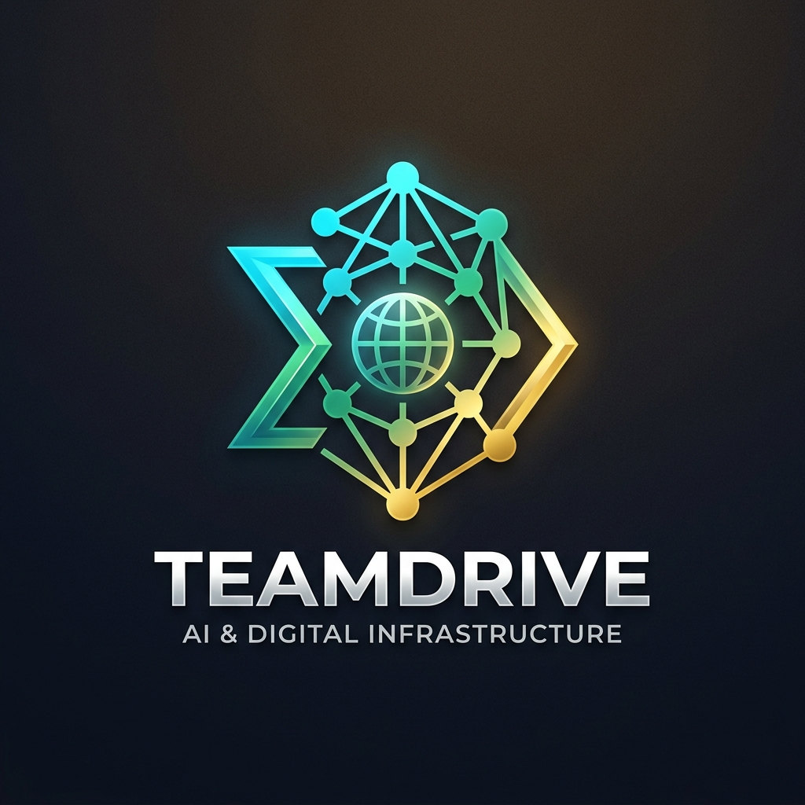

# 🌐 BRICS InfraPulse AI (*ИнфраПульс / 基础设施脉搏 / PulsoInfra / इन्फ्रापल्स*)
### A Scalable, Multilingual Digital Public Good (DPG) Platform for Citizen Infrastructure Intelligence & Policymaker Governance Co-Pilot

[](https://github.com/CodeByPrakash/Hack2Skill_BuildWithAI_2)
[](https://github.com/CodeByPrakash)
[](https://hack2skill.com/event/codeforcommunities2)
[](https://hack2skill.com/event/codeforcommunities2)
[](https://digitalpublicgoods.net/)
[]()

---

## ⚡ Quick Evaluation & Navigation Index
> 💡 *Click any link below for instant evaluation of our hackathon submission artifacts, pitch decks, and technical blueprints:*

| Document | Purpose & Description | Fast GitHub Link |
| :--- | :--- | :--- |
| 🏆 **Official Submission Solution** | Complete problem statement breakdown, solution architecture, and impact metrics for Hack2Skill judges. | [**`HACKATHON_SUBMISSION_SOLUTION.md`**](./HACKATHON_SUBMISSION_SOLUTION.md) |
| 📊 **Gamma AI Presentation Deck** | 10-card, copy-paste ready presentation pitch deck refined for [Gamma.app](https://gamma.app). | [**`GAMMA_AI_PRESENTATION_DECK.md`**](./GAMMA_AI_PRESENTATION_DECK.md) |
| 🎥 **Video Demo & Pitch Script** | Word-for-word spoken pitch, scene timeline, on-screen text popups, and recording instructions. | [**`VIDEO_DEMO_SCRIPT.md`**](./VIDEO_DEMO_SCRIPT.md) |
| 🎬 **Strategic Documentary Blueprint** | Deep-dive strategic analysis from the **CEO**, **CMO**, and **CTO / Developer** perspectives. | [**`DOCUMENTARY_AND_STRATEGIC_BLUEPRINT.md`**](./DOCUMENTARY_AND_STRATEGIC_BLUEPRINT.md) |

---

## 📌 Problem Statement Alignment & Hackathon Context

| Dimension | Details |
| :--- | :--- |
| **Hackathon Event** | [Code for Communities 2.0 (Hack2Skill)](https://hack2skill.com/event/codeforcommunities2/registration?utm_campaign=codeforcommunities2&utm_term=6a8701b7a1ad3881e434e0a5&utm_medium=url&isRequest=true&team_name=TechDrive) |
| **Repository** | [**`https://github.com/CodeByPrakash/Hack2Skill_BuildWithAI_2`**](https://github.com/CodeByPrakash/Hack2Skill_BuildWithAI_2) |
| **Lead Developer** | [**`@CodeByPrakash`**](https://github.com/CodeByPrakash) |
| **Track** | **Track 1 — AI for Digital Public Infrastructure & Governance** |
| **BRICS Theme** | **Innovation (Problem Statement 1)** |
| **Problem Statement 1** | *Build a scalable, multilingual AI platform — designed as a Digital Public Good — that aggregates citizen development requests via voice, text, and messaging apps across diverse linguistic regions. The system should analyse large datasets combining citizen feedback with national demographic data, infrastructure indices, and public investment plans, surfacing demand hotspots and recommending high-priority development projects to national policymakers across BRICS nations.* |

---

## 🎯 The Core Problem vs. Our Solution

```
                               THE PROBLEM
  +-----------------------------------------------------------------------+
  |  Fragmented Grievance Silos  •  Linguistic & Digital Literacy Gaps     |
  |  Misaligned Public Spending   •  Unaddressed High-Vulnerability Deficits|
  |  Zero Citizen Tracking      •  No Way to Measure DPI Capital ROI      |
  +-----------------------------------------------------------------------+
                                     │
                                     ▼
                    OUR INNOVATION: BRICS INFRAPULSE AI
  +-----------------------------------------------------------------------+
  |  🎙️ Omnichannel Intake: Multilingual Voice STT, WhatsApp & Rural SMS  |
  |  🧠 DPI AI Ingestion: Automated Intent, Urgency (1-100), & Geo-Cluster|
  |  🗺️ Multi-Layer GIS: Hotspots x Demographics x Infra Deficits x Budget|
  |  🤖 Policymaker Co-Pilot: Multi-Criteria (MCDA) Project Recommendations|
  |  📊 What-If Simulator: Pareto-Optimal Dynamic Budget Capital Allocator|
  |  🎫 Verifiable Audit: Cryptographic DPI Token & 6-Stage Tracking Trail |
  +-----------------------------------------------------------------------+
```

---

## 👥 Multi-Perspective Stakeholder Context

BRICS InfraPulse AI is engineered from the ground up to address the distinct needs, pain points, and incentives of all stakeholders across the public infrastructure lifecycle:

### 1. 👩‍🌾 Citizen & Grassroots Community Perspective
- **Frictionless Omnichannel Voice-First Access**: Citizens can simply speak in their native tongue or regional dialect (Hindi, Mandarin, Russian, Portuguese, Zulu, Arabic, Bengali, Marathi, etc.) without needing complex app installations.
- **Low-Bandwidth & Feature Phone Inclusivity**: Integrated SMS/Telegram gateway allows citizens in remote desert, mountain, or forest areas with 2G connectivity to file structured complaints via `#REPORT` SMS syntax.
- **Cryptographic Trust & Accountability**: Every submission instantly generates a verifiable `DPI Ticket ID` (e.g., `DPI-IN-2026-1001`) with a SHA-256 audit hash.
- **Transparent 6-Stage Tracking**: Citizens can track the exact status of their demand from *Ingestion* ➔ *AI Clustering* ➔ *Policy Prioritization* ➔ *Budget Allocation* ➔ *Under Construction* ➔ *Completed*.

### 2. 🏛️ National Policymakers, Ministers & Urban Planners Perspective
- **Unified Geospatial Intelligence Map**: Eliminates department silos by overlaying citizen demand hotspots directly over census demographic vulnerability data, existing infrastructure deficit indices, and ongoing capital projects.
- **Explainable Multi-Criteria Algorithmic Ranking (MCDA)**: Replaces subjective political lobbying with a transparent mathematical decision model:
  $$\text{Priority Score} = 0.30 \cdot D_{\text{demand}} + 0.25 \cdot I_{\text{gap}} + 0.20 \cdot V_{\text{vulnerability}} + 0.15 \cdot M_{\text{SDG}} + 0.10 \cdot E_{\text{feasibility}}$$
- **"What-If" Capital Scenario Simulator**: Interactive capital slider allows planners to dynamically reallocate $X Million or local currency (`INR`, `BRL`, `RUB`, `CNY`, `ZAR`, `AED`, `EGP`) and evaluate lives impacted, coverage %, and waste reduction in real-time.
- **One-Click Formal Policy Brief Export**: Generates bilingual, print-ready executive dossiers for cabinet meetings and parliamentary approvals.

### 3. 🌐 Digital Public Goods (DPG) & Open Governance Perspective
- **100% Compliant with DPGA 9 Core Criteria**: Open-source, permissive licensing, open data schemas (JSON-LD / OpenAPI 3.0), and Beckn-DPI protocol alignment.
- **Privacy by Design & Differential Privacy**: Citizen phone numbers, biometric audio patterns, and identifiable personal data are scrubbed on the client edge before ingestion, ensuring total citizen safety and GDPR/data sovereignty compliance.
- **Cross-Border BRICS+ Interoperability**: Sovereign nations can federate infrastructure data for joint economic corridors (e.g., BRICS Maritime Logistics, International North-South Transport Corridor, Trans-African Power Pools).

### 4. 🏦 Multilateral Development Banks (NDB / BRICS Bank / World Bank) Perspective
- **Bankable, High-Impact Project Dossiers**: Pre-packaged project proposals with calculated benefit-cost ratios (ROI score out of 5.0), delivery timelines, and lead agency assignments.
- **UN SDG Verification**: Direct tagging and impact scorecards aligned with SDG 6 (Clean Water), SDG 7 (Clean Energy), SDG 9 (Industry & Infrastructure), SDG 11 (Sustainable Communities), and SDG 3 (Good Health).

---

## 🏛️ System Architecture

```
+---------------------------------------------------------------------------------------------------+
|                            OMNICHANNEL CITIZEN INTAKE LAYER                                      |
|  +------------------------+  +------------------------+  +-------------------------------------+  |
|  | Voice Input (Multilingual|  | WhatsApp / Telegram    |  | Web Citizen Portal                  |  |
|  | Speech-to-Text & Audio)|  | Simulated DPI Bots     |  | (Geotag, Category, Urgent Slider)   |  |
|  +------------------------+  +------------------------+  +-------------------------------------+  |
+-------------------------------------------------+-------------------------------------------------+
                                                  |
                                                  v
+---------------------------------------------------------------------------------------------------+
|                        DPG-COMPLIANT AI INGESTION & NLU ENGINE                                    |
|  * Multilingual Translation & Normalization (Hindi, Mandarin, Russian, Portuguese, Arabic, English)|
|  * Automated Intent, Urgency (1-100), & Sector Tagging (Water, Energy, Transport, Health, Digital)|
|  * Spatial Entity Extraction & Geospatial Deduplication / Clustering Engine                       |
|  * PII Anonymization & Cryptographic Verifiable Citizen DPI Token Generation                      |
+-------------------------------------------------+-------------------------------------------------+
                                                  |
                                                  v
+---------------------------------------------------------------------------------------------------+
|                     DATA FUSION & MULTI-LAYER GEOSPATIAL INTELLIGENCE                             |
|  +---------------------------+  +---------------------------+  +-------------------------------+  |
|  | Layer 1: Citizen Demand   |  | Layer 2: Demographic Data |  | Layer 3: Infrastructure Gap   |  |
|  | Hotspots & Density Heatmap|  | (Vulnerability, Density)  |  | & Baseline Indices            |  |
|  +---------------------------+  +---------------------------+  +-------------------------------+  |
|                               +---------------------------+                                       |
|                               | Layer 4: National Capital |                                       |
|                               | Investment & Active Plans |                                       |
|                               +---------------------------+                                       |
+-------------------------------------------------+-------------------------------------------------+
                                                  |
                                                  v
+---------------------------------------------------------------------------------------------------+
|               POLICYMAKER CO-PILOT & AI CAPITAL ALLOCATION ENGINE                                 |
|  * Multi-Criteria Prioritization Scoring Model (Demand x Deficit x Vulnerability x SDG Impact)     |
|  * Actionable Project Recommendation Dossiers with Budget, Timelines, SDG Badges, & Citizen Voice |
|  * What-If Scenario Budget Optimizer (Dynamic Slider for National Capital Allocations)             |
|  * Automated Bilingual Policy Brief & Executive DPI Impact Report Generator (PDF / Export)        |
|  * Open API / DPG Standard Registry & Interoperability Explorer (Beckn / ONDC Compatible)        |
+---------------------------------------------------------------------------------------------------+
```

---

## 🎨 Claymorphism & Warm Cream Aesthetic

BRICS InfraPulse AI features a state-of-the-art **Claymorphism Design System** designed with warm cream, white, and earthy undertones:
- **3D Soft Tactile Cards & Panels**: Smooth pillowy inner highlights (`inset 3px 3px 6px rgba(255,255,255,0.9)`) combined with soft organic drop shadows.
- **Tactile Clay Pills & Buttons**: High border radii (`20px - 28px`) with physical press states.
- **Warm Cream & Ivory Canvas**: `#f6f3eb` base canvas with `#ffffff` clay cards and high-contrast typography (`#1c1917` / `#0284c7` / `#059669`).
- **CartoDB Voyager Light Basemap**: High-performance interactive light map tiles that integrate with the claymorphic aesthetic.

---

## 🚀 Key Modules & Capabilities

### 1. 🗺️ Multi-Layer Geospatial Intelligence Map (`MapView.jsx`)
- **Interactive Multi-Layer Fusion**: Toggle between Citizen Demand Hotspots, Demographic Vulnerability Index, Infrastructure Deficit Indices (Water, Road, Energy, Health), and Active Capital Projects.
- **Granular Regional Drilling**: Seamless zoom into Indian States (UP, Bihar, Maharashtra, Rajasthan, Assam), Brazilian States (Bahia, Amazonas, Minas Gerais), Russian Federal Districts, Chinese Provinces, South African Provinces, UAE Emirates, and Egyptian Governorates.
- **Hotspot Inspector**: Click any glowing cluster marker to view verbatim citizen voice testimony, urgency rating, impacted population, and cryptographic verification hash.

### 2. 📱 Omnichannel Citizen Messaging Simulators (`WhatsAppBotSim.jsx` & `TelegramBotSim.jsx`)
- **Interactive Smartphone Mockup**: Realistic WhatsApp DPI Citizen Bot supporting audio voice notes, quick suggestions, text in native languages, and automated ticket generation.
- **Rural 2G/3G SMS Gateway**: Lightweight command terminal for remote areas supporting quick SMS commands (e.g. `#REPORT WATER Rampur Borewell broken 4 months`).

### 3. 🎙️ Multilingual Voice & Web Intake Hub (`CitizenIntakeModal.jsx`)
- **Real-Time Web Speech Recognition (STT)**: Direct microphone input with live animated audio waveform and dialect normalization.
- **Multi-Language Quick Presets**: Test one-click citizen reports in Hindi, Mandarin, Russian, Portuguese, English, and Arabic.
- **Urgency Slider & Confetti**: Dynamic 1-100 severity scoring with celebratory particle confetti upon cryptographic receipt generation.

### 4. 🤖 Policymaker AI Co-Pilot & Bankable Proposals (`PolicymakerCopilot.jsx`)
- **Actionable Project Dossiers**: AI-synthesized infrastructure initiatives with cost in local currency and USD, targeted beneficiaries, delivery timelines, lead public agencies, and DPI technology enablers.
- **Verbatim Voice Playback**: Web Speech TTS synthesis reads out translated citizen quotes.
- **One-Click Policy Brief Generator**: Generates print-ready formal PDF executive briefings for ministerial review.

### 5. 📊 "What-If" Capital Budget Scenario Simulator (`BudgetSimulator.jsx`)
- **Dynamic Budget Slider**: Policymakers can adjust available infrastructure capital ($20M to $500M+) and watch the algorithm dynamically optimize funded initiatives.
- **Pareto Comparison**: Visual side-by-side contrast between *Traditional Disjointed Spending* (-38% waste) and *AI Demand-Driven Allocation* (+94.8% efficiency).

### 6. 🔍 Citizen Request Tracker (`CitizenTracker.jsx`)
- **End-to-End Audit Trail**: Search any DPI Ticket ID or SHA-256 token and trace its lifecycle through all 6 governance stages.

### 7. 📈 Demographic & Infrastructure Analytics Hub (`AnalyticsDashboard.jsx`)
- **Chart.js Powered Visualizations**:
  - Regional Deficit Bar Chart (Water vs Road vs Energy vs Health).
  - Citizen Demands by Category Doughnut Chart.
  - Omnichannel Intake Modality Chart (Voice vs WhatsApp vs Telegram vs Web).
  - BRICS Multilateral DPI Maturity Benchmark Radar Chart.

### 8. 🛡️ Digital Public Good (DPG) & Open Standards Registry (`DPGStandardsView.jsx`)
- **DPGA 9 Core Criteria Scorecard**: Verifiable 100% compliance audit.
- **Interactive JSON-LD / OpenAPI Playground**: Copy or download standardized cross-border DPI payload.

---

## 🛠️ Technology Stack

| Layer | Technologies Used |
| :--- | :--- |
| **Frontend Core** | React 18, Vite (Fast HMR), Modern ES6+ JavaScript |
| **Styling & Theme** | Bespoke Claymorphism Design System, CSS Variables, CSS Grid/Flexbox |
| **Typography** | Google Fonts (`Outfit`, `Inter`, `JetBrains Mono`) |
| **Geospatial GIS** | Leaflet, React-Leaflet, CartoDB Voyager Light Tiles |
| **Data Visualization** | Chart.js, React-Chartjs-2 (Radar, Bar, Doughnut) |
| **Speech & Audio AI** | Web Speech Recognition (STT), Realistic Neural Female Voice Synthesis (TTS), Waveform |
| **Iconography & FX** | Lucide React, Canvas-Confetti |
| **Standards & Specs** | Digital Public Goods Alliance (DPGA), JSON-LD, Beckn Protocol |

---

## 💻 Installation & Quick Start

### Prerequisites
- Node.js `v18.0.0` or higher
- npm `v9.0.0` or higher

### Steps to Run Locally

1. **Clone the repository**:
   ```bash
   git clone https://github.com/CodeByPrakash/Hack2Skill_BuildWithAI_2.git
   cd Hack2Skill_BuildWithAI_2
   ```

2. **Install dependencies**:
   ```bash
   npm install
   ```

3. **Start the local development server**:
   ```bash
   npm run dev
   ```

4. **Open your browser**:
   Navigate to `http://localhost:5173/`

5. **Build for production**:
   ```bash
   npm run build
   ```

---

## 👥 Meet TeamDrive (TechDrive)
<div align="center">
  
  <h3>🚀 TeamDrive — Architecting Sovereign Digital Public Infrastructure</h3>
  <p><em>"Bridging Grassroots Citizen Voice and Sovereign Capital Allocation across the Global South."</em></p>
</div>

### 🌟 About Our Team
**TeamDrive (TechDrive)** is an engineering and AI innovation collective dedicated to building scalable, open-source **Digital Public Goods (DPGs)** for public governance, civic accountability, and societal empowerment. 

Participating in **Code for Communities 2.0 (Hack2Skill)** under **Track 1: AI for Digital Public Infrastructure & Governance**, our mission is to eliminate bureaucratic silos and democratize infrastructure development for **3.6 billion citizens across BRICS+ nations**.

### 🛠️ Core Engineering Strengths & DNA
* **Edge-to-Cloud Multilingual AI:** Designing zero-friction speech recognition, dialect normalization, and client-side differential privacy protocols for non-literate and multilingual populations.
* **Geospatial GIS & Spatial Data Fusion:** Integrating real-time citizen demand telemetry with national census demographics and infrastructure deficit indices.
* **Algorithmic Public Finance & MCDA:** Implementing explainable mathematical Multi-Criteria Decision Analysis and Pareto Knapsack capital budget optimization.
* **DPGA & Beckn Protocol Adherence:** Championing 100% compliance with UN Digital Public Goods Alliance criteria, open data schemas (JSON-LD), and interoperable sovereign protocols.

### 👤 Leadership & Team Profile
* **Lead Architect & Full-Stack DPG Engineer:** [**Prakash (@CodeByPrakash)**](https://github.com/CodeByPrakash) | [**Prakash**](https://omprakashbehera.me/)
  * *Focus:* System Architecture, Geospatial GIS Pipelines, Multilingual AI Engine, Mathematical Optimization & UX Design.
* **Repository:** [**`https://github.com/CodeByPrakash/Hack2Skill_BuildWithAI_2`**](https://github.com/CodeByPrakash/Hack2Skill_BuildWithAI_2)
* **Hackathon:** Code for Communities 2.0 (Hack2Skill)
* **Theme:** BRICS Innovation (Problem Statement 1)
